# Respondr Use Case Diagram

This document contains the UML Use Case Diagram for the Respondr disaster response management system.

## Use Case Diagram (Mermaid)

> **Legend:**
> - **Solid arrows (-->)**: Actor to Use Case associations

```mermaid
graph TB
    %% Actors
    Admin[👤 Admin]
    Supervisor[👤 Supervisor]
    Operator[👤 Operator]
    Borrower[👤 Borrower]
    System[⚙️ System]

    %% Authentication Use Cases
    Login[Login to System]
    Signup[Register Account]
    Logout[Logout from System]

    %% User Management Use Cases
    ViewUsers[View Users]
    CreateUser[Create User]
    EditUser[Edit User]
    DeleteUser[Delete User]
    ToggleUserStatus[Toggle User Status]
    SearchUsers[Search/Filter Users]

    %% Resource Management Use Cases
    ViewResources[View Resources]
    CreateResource[Create Resource]
    EditResource[Edit Resource]
    DeleteResource[Delete Resource]
    BorrowResource[Borrow Resource]
    ReturnResource[Return Resource]
    TrackMaintenance[Track Maintenance]
    ManageBorrowers[Manage Borrowers]
    ViewResourceDetails[View Resource Details]
    SearchResources[Search/Filter Resources]

    %% Operations Management Use Cases
    ViewOperations[View Operations]
    CreateOperation[Create Operation]
    EditOperation[Edit Operation]
    DeleteOperation[Delete Operation]
    ViewMap[View Interactive Map]
    AssignResourcesToOp[Assign Resources to Operation]
    TrackOperationStatus[Track Operation Status]

    %% Situation Reports Use Cases
    ViewSitRep[View Situation Reports]
    CreateSitRep[Create Situation Report]
    EditSitRep[Edit Situation Report]
    DeleteSitRep[Delete Situation Report]
    UploadDocuments[Upload Documents]
    DownloadDocuments[Download Documents]
    SearchSitRep[Search/Filter Reports]
    BulkDeleteSitRep[Bulk Delete Reports]

    %% Weather Station Use Cases
    ViewWeather[View Weather Data]
    ViewAdvisories[View Weather Advisories]

    %% Reports Use Cases
    ViewReports[View Reports]
    GenerateReports[Generate Reports]
    ExportReports[Export Reports]

    %% Settings Use Cases
    ViewSettings[View Settings]
    EditSettings[Edit Settings]

    %% Dashboard Use Cases
    ViewDashboard[View Dashboard]
    ViewMetrics[View Metrics]
    ViewActivityStream[View Activity Stream]

    %% System Use Cases
    OfflineSync[Offline Synchronization]
    NetworkMonitoring[Network State Monitoring]

    %% Actor to Use Case Relationships - Admin
    Admin --> Login
    Admin --> Logout
    Admin --> ViewUsers
    Admin --> CreateUser
    Admin --> EditUser
    Admin --> DeleteUser
    Admin --> ToggleUserStatus
    Admin --> SearchUsers
    Admin --> ViewResources
    Admin --> CreateResource
    Admin --> EditResource
    Admin --> DeleteResource
    Admin --> BorrowResource
    Admin --> ReturnResource
    Admin --> TrackMaintenance
    Admin --> ManageBorrowers
    Admin --> ViewResourceDetails
    Admin --> SearchResources
    Admin --> ViewOperations
    Admin --> CreateOperation
    Admin --> EditOperation
    Admin --> DeleteOperation
    Admin --> ViewMap
    Admin --> AssignResourcesToOp
    Admin --> TrackOperationStatus
    Admin --> ViewSitRep
    Admin --> CreateSitRep
    Admin --> EditSitRep
    Admin --> DeleteSitRep
    Admin --> UploadDocuments
    Admin --> DownloadDocuments
    Admin --> SearchSitRep
    Admin --> BulkDeleteSitRep
    Admin --> ViewWeather
    Admin --> ViewAdvisories
    Admin --> ViewReports
    Admin --> GenerateReports
    Admin --> ExportReports
    Admin --> ViewSettings
    Admin --> EditSettings
    Admin --> ViewDashboard
    Admin --> ViewMetrics
    Admin --> ViewActivityStream

    %% Actor to Use Case Relationships - Supervisor
    Supervisor --> Login
    Supervisor --> Logout
    Supervisor --> ViewUsers
    Supervisor --> CreateUser
    Supervisor --> EditUser
    Supervisor --> DeleteUser
    Supervisor --> ToggleUserStatus
    Supervisor --> SearchUsers
    Supervisor --> ViewResources
    Supervisor --> CreateResource
    Supervisor --> EditResource
    Supervisor --> DeleteResource
    Supervisor --> BorrowResource
    Supervisor --> ReturnResource
    Supervisor --> TrackMaintenance
    Supervisor --> ManageBorrowers
    Supervisor --> ViewResourceDetails
    Supervisor --> SearchResources
    Supervisor --> ViewOperations
    Supervisor --> CreateOperation
    Supervisor --> EditOperation
    Supervisor --> DeleteOperation
    Supervisor --> ViewMap
    Supervisor --> AssignResourcesToOp
    Supervisor --> TrackOperationStatus
    Supervisor --> ViewSitRep
    Supervisor --> CreateSitRep
    Supervisor --> EditSitRep
    Supervisor --> DeleteSitRep
    Supervisor --> UploadDocuments
    Supervisor --> DownloadDocuments
    Supervisor --> SearchSitRep
    Supervisor --> BulkDeleteSitRep
    Supervisor --> ViewWeather
    Supervisor --> ViewAdvisories
    Supervisor --> ViewReports
    Supervisor --> GenerateReports
    Supervisor --> ExportReports
    Supervisor --> ViewSettings
    Supervisor --> EditSettings
    Supervisor --> ViewDashboard
    Supervisor --> ViewMetrics
    Supervisor --> ViewActivityStream

    %% Actor to Use Case Relationships - Operator
    Operator --> Login
    Operator --> Logout
    Operator --> ViewResources
    Operator --> BorrowResource
    Operator --> ReturnResource
    Operator --> ViewResourceDetails
    Operator --> SearchResources
    Operator --> ViewOperations
    Operator --> ViewMap
    Operator --> ViewSitRep
    Operator --> CreateSitRep
    Operator --> UploadDocuments
    Operator --> DownloadDocuments
    Operator --> SearchSitRep
    Operator --> ViewWeather
    Operator --> ViewAdvisories
    Operator --> ViewReports
    Operator --> ViewSettings
    Operator --> ViewDashboard
    Operator --> ViewMetrics

    %% Actor to Use Case Relationships - Borrower
    Borrower --> BorrowResource
    Borrower --> ReturnResource

    %% System Relationships
    System --> OfflineSync
    System --> NetworkMonitoring
    Admin -.-> OfflineSync
    Supervisor -.-> OfflineSync
    Operator -.-> OfflineSync

    %% Include Relationships (<<include>>) - Mandatory
    ViewDashboard -.->|<<include>>| ViewMetrics
    ViewDashboard -.->|<<include>>| ViewActivityStream
    CreateOperation -.->|<<include>>| ViewMap
    AssignResourcesToOp -.->|<<include>>| ViewResources
    AssignResourcesToOp -.->|<<include>>| ViewOperations
    BorrowResource -.->|<<include>>| ViewResources
    ReturnResource -.->|<<include>>| ViewResources
    UploadDocuments -.->|<<include>>| CreateSitRep
    DownloadDocuments -.->|<<include>>| ViewSitRep
    GenerateReports -.->|<<include>>| ViewReports
    ExportReports -.->|<<include>>| GenerateReports
    ViewResourceDetails -.->|<<include>>| ViewResources
    EditResource -.->|<<include>>| ViewResources
    EditOperation -.->|<<include>>| ViewOperations
    EditSitRep -.->|<<include>>| ViewSitRep
    EditUser -.->|<<include>>| ViewUsers
    DeleteResource -.->|<<include>>| ViewResources
    DeleteOperation -.->|<<include>>| ViewOperations
    DeleteSitRep -.->|<<include>>| ViewSitRep
    DeleteUser -.->|<<include>>| ViewUsers
    ToggleUserStatus -.->|<<include>>| ViewUsers

    %% Extend Relationships (<<extend>>) - Optional
    SearchResources -.->|<<extend>>| ViewResources
    SearchUsers -.->|<<extend>>| ViewUsers
    SearchSitRep -.->|<<extend>>| ViewSitRep
    BulkDeleteSitRep -.->|<<extend>>| ViewSitRep
    TrackMaintenance -.->|<<extend>>| ViewResources
    ManageBorrowers -.->|<<extend>>| BorrowResource
    TrackOperationStatus -.->|<<extend>>| ViewOperations

    %% Styling
    classDef actor fill:#e1f5ff,stroke:#01579b,stroke-width:2px
    classDef useCase fill:#f3e5f5,stroke:#4a148c,stroke-width:1px
    classDef system fill:#fff3e0,stroke:#e65100,stroke-width:2px

    class Admin,Supervisor,Operator,Borrower actor
    class System system
```

> - **Dashed arrows (-.->) with <<include>>**: Mandatory include relationships
> - **Dashed arrows (-.->) with <<extend>>**: Optional extend relationships

## Use Case Descriptions

### Authentication
- **Login**: Authenticate user credentials to access the system
- **Signup**: Register a new user account (typically admin-only)
- **Logout**: Securely exit the system

### User Management (Admin & Supervisor Only)
- **View Users**: Display list of all system users
- **Create User**: Add new user accounts with role assignment
- **Edit User**: Modify user profile information
- **Delete User**: Remove user accounts from the system
- **Toggle User Status**: Activate/deactivate user accounts
- **Search Users**: Find users by name, department, or type

### Resource Management
- **View Resources**: Browse resource inventory
- **Create Resource**: Add new resources to inventory
- **Edit Resource**: Update resource information
- **Delete Resource**: Remove resources from inventory
- **Borrow Resource**: Check out resources to borrowers
- **Return Resource**: Process resource returns
- **Track Maintenance**: Schedule and monitor resource maintenance
- **Manage Borrowers**: Create and manage borrower profiles
- **View Resource Details**: See detailed resource information
- **Search Resources**: Filter resources by category, name, or availability

### Operations Management
- **View Operations**: Display all emergency operations
- **Create Operation**: Set up new emergency operations
- **Edit Operation**: Update operation details
- **Delete Operation**: Remove operations from system
- **View Interactive Map**: Access Davao Oriental municipality map
- **Assign Resources to Operation**: Allocate resources to specific operations
- **Track Operation Status**: Monitor active and concluded operations

### Situation Reports (SitRep)
- **View Situation Reports**: Browse all situation reports
- **Create Situation Report**: Generate new situation reports
- **Edit Situation Report**: Modify existing reports
- **Delete Situation Report**: Remove reports from system
- **Upload Documents**: Attach files (PDF, DOC, images) to reports
- **Download Documents**: Retrieve documents for offline access
- **Search/Filter Reports**: Find reports by category, date, or keywords
- **Bulk Delete Reports**: Delete multiple reports at once

### Weather Station
- **View Weather Data**: Access current weather information
- **View Weather Advisories**: Display PAGASA weather advisories

### Reports
- **View Reports**: Display generated reports
- **Generate Reports**: Create new reports from system data
- **Export Reports**: Download reports in various formats

### Settings
- **View Settings**: Access system configuration
- **Edit Settings**: Modify system preferences

### Dashboard
- **View Dashboard**: Access main dashboard interface
- **View Metrics**: See key performance indicators
- **View Activity Stream**: Monitor recent system activities

### System Features
- **Offline Synchronization**: Automatically sync data when connectivity is restored
- **Network State Monitoring**: Detect and respond to network connectivity changes

## Actor Descriptions

### Admin
- Full system access with all permissions
- Can manage users, resources, operations, and reports
- Has system administration capabilities

### Supervisor
- Same permissions as Admin
- Can manage all aspects of the system
- Typically oversees operations and coordinates resources

### Operator
- Limited access to core functionality
- Can view resources, borrow/return items, view operations
- Can create situation reports but cannot edit/delete them
- Cannot manage users or perform administrative tasks

### Borrower
- External actor who borrows resources
- Interacts with the system through operators/admins
- Can borrow and return resources

## Permission Matrix

| Feature | Admin | Supervisor | Operator |
|---------|-------|------------|----------|
| User Management | ✅ Full | ✅ Full | ❌ None |
| Resource Management | ✅ Full | ✅ Full | ⚠️ View/Borrow/Return Only |
| Operations Management | ✅ Full | ✅ Full | ⚠️ View Only |
| Situation Reports | ✅ Full | ✅ Full | ⚠️ View/Create Only |
| Weather Station | ✅ Full | ✅ Full | ✅ Full |
| Reports | ✅ Full | ✅ Full | ⚠️ View Only |
| Settings | ✅ Full | ✅ Full | ⚠️ View Only |

## Include and Extend Relationships

### Include Relationships (<<include>>)
**Include** represents a mandatory relationship where the included use case is always executed as part of the base use case.

| Base Use Case | Included Use Case | Description |
|---------------|-------------------|-------------|
| ViewDashboard | ViewMetrics | Dashboard always displays metrics |
| ViewDashboard | ViewActivityStream | Dashboard always displays activity stream |
| CreateOperation | ViewMap | Creating operation requires viewing the map |
| AssignResourcesToOp | ViewResources | Assigning resources requires viewing available resources |
| AssignResourcesToOp | ViewOperations | Assigning resources requires viewing operations |
| BorrowResource | ViewResources | Borrowing requires viewing resource list first |
| ReturnResource | ViewResources | Returning requires viewing resource list first |
| UploadDocuments | CreateSitRep | Uploading documents is part of creating a sitrep |
| DownloadDocuments | ViewSitRep | Downloading requires viewing sitrep first |
| GenerateReports | ViewReports | Generating reports includes viewing them |
| ExportReports | GenerateReports | Exporting reports includes generating them |
| ViewResourceDetails | ViewResources | Viewing details requires viewing resource list |
| EditResource | ViewResources | Editing requires viewing resources first |
| EditOperation | ViewOperations | Editing requires viewing operations first |
| EditSitRep | ViewSitRep | Editing requires viewing sitrep first |
| EditUser | ViewUsers | Editing requires viewing users first |
| DeleteResource | ViewResources | Deleting requires viewing resources first |
| DeleteOperation | ViewOperations | Deleting requires viewing operations first |
| DeleteSitRep | ViewSitRep | Deleting requires viewing sitrep first |
| DeleteUser | ViewUsers | Deleting requires viewing users first |
| ToggleUserStatus | ViewUsers | Toggling status requires viewing users first |

### Extend Relationships (<<extend>>)
**Extend** represents an optional relationship where the extending use case adds behavior to the base use case under certain conditions.

| Base Use Case | Extending Use Case | Condition/Description |
|---------------|-------------------|----------------------|
| ViewResources | SearchResources | User may optionally search/filter resources |
| ViewResources | TrackMaintenance | User may optionally track maintenance for resources |
| ViewUsers | SearchUsers | User may optionally search/filter users |
| ViewSitRep | SearchSitRep | User may optionally search/filter situation reports |
| ViewSitRep | BulkDeleteSitRep | User may optionally perform bulk delete operations |
| ViewOperations | TrackOperationStatus | User may optionally track operation status changes |
| BorrowResource | ManageBorrowers | User may optionally manage borrower profiles during borrowing |

### Relationship Summary

**Total Include Relationships**: 20 mandatory relationships
**Total Extend Relationships**: 7 optional relationships

## Notes

- **Admin and Supervisor** have identical permissions in the current system
- **Operator** has read-only access to most features with limited write capabilities
- **Borrowers** are external entities that interact through system users
- The system supports **offline-first** architecture with automatic synchronization
- All use cases support **cross-platform** access (iOS, Android, Web)
- **Include relationships** are mandatory and always executed
- **Extend relationships** are optional and executed conditionally

